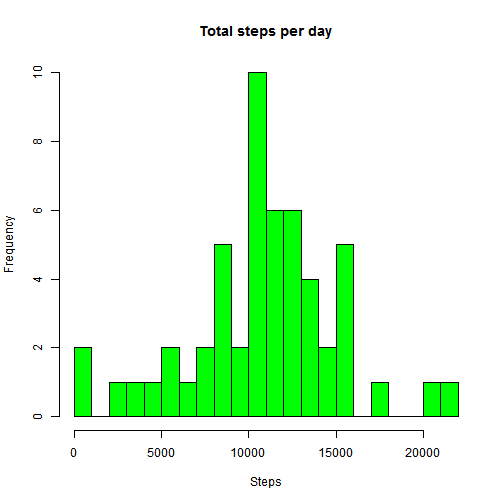
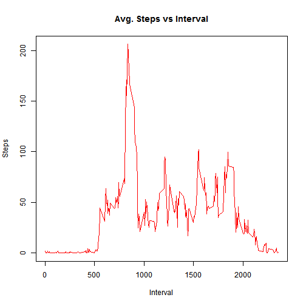
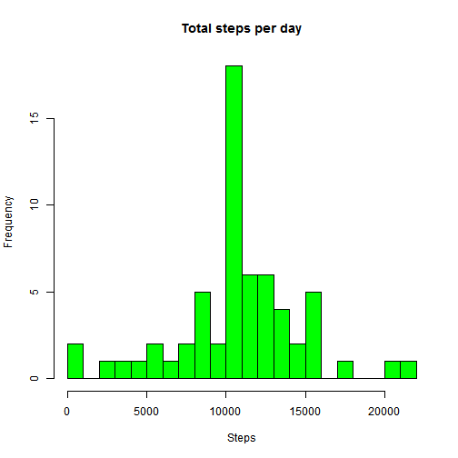
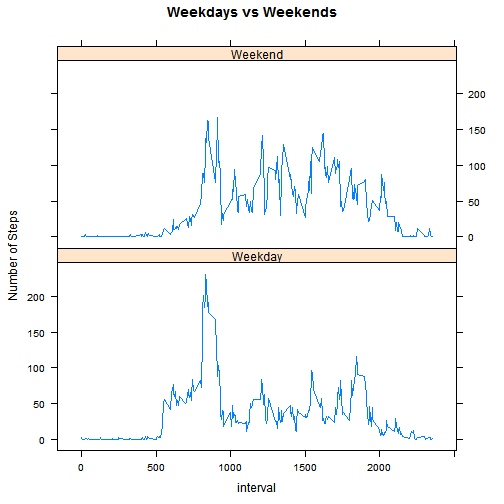

# Report: Activity Tracker Data Analysis
========================================================
  
# Author: Jorge Chong Chang
# Coursera course: Reproducible Research  


## Introduction
This reports covers a brief analysis of data collected by a activity monitor. Data is
collected at 5 minutes intervals through out the day. 

## Data source
The data file can be downloaded here [Activity monitor data](https://d396qusza40orc.cloudfront.net/repdata%2Fdata%2Factivity.zip)
The dataset has the following variables:
+  **steps**: Number of steps taken in a 5-minutes interval (missing values: NA)
+  **date**: Date on which the measurement has been taken. Format YYYY-MM-DD
+  **interval**: Identifier for the 5-minute interval in which the measure was taken

==============================================

## Loading and preprocessing the data
It's not necessary to download the dataset because it's contained in the repository in the file
activity.zip. We have to read the file **activity.csv** using `read.csv()`:


```r
dataset <- read.csv(unzip("activity.zip", "activity.csv"), 
                    header = TRUE, 
                    colClasses = c("numeric", "Date", "numeric")
                    )
summary(dataset)
```

```
##      steps             date               interval     
##  Min.   :  0.00   Min.   :2012-10-01   Min.   :   0.0  
##  1st Qu.:  0.00   1st Qu.:2012-10-16   1st Qu.: 588.8  
##  Median :  0.00   Median :2012-10-31   Median :1177.5  
##  Mean   : 37.38   Mean   :2012-10-31   Mean   :1177.5  
##  3rd Qu.: 12.00   3rd Qu.:2012-11-15   3rd Qu.:1766.2  
##  Max.   :806.00   Max.   :2012-11-30   Max.   :2355.0  
##  NA's   :2304
```

The dataset has **17568** observations

==============================================

## What is mean total number of steps taken per day?
### 1. Total number of steps per day
In order to work with the data we have to filter NA values for **steps** and 
then aggregate data by day calculating the sum of steps:

```r
ds_filtered <- dataset[!(is.na(dataset$steps)),]
da_f <- aggregate(list(steps = ds_filtered$steps), list(date = ds_filtered$date), sum)
head(da_f, n = 10)
```

```
##          date steps
## 1  2012-10-02   126
## 2  2012-10-03 11352
## 3  2012-10-04 12116
## 4  2012-10-05 13294
## 5  2012-10-06 15420
## 6  2012-10-07 11015
## 7  2012-10-09 12811
## 8  2012-10-10  9900
## 9  2012-10-11 10304
## 10 2012-10-12 17382
```

### 2. Histogram
Using the dataframe **`da_f`** we plot the histogram of the sum of steps per day:


```r
hist(da_f$steps, 
     main = "Total steps per day", 
     col = "green",
     ylab = "Frequency",
     xlab = "Steps",
     breaks = 20
     )
```

 

### 3. Mean and median of total number of steps
Using `mean()` and `median()` we can calculate the **mean** and the **median** respectively for
the number of steps taken per day:

```r
m_ds <- mean(da_f$steps)
md_ds <- median(da_f$steps)
```

The results are:
+ **mean** = 10766.19
+ **median** = 10765


==============================================

## What is the average daily activity pattern?
### 1. Time series plot
Aggregating the data by the 5-minutes interval, we can plot a time series with the average
per interval:

```r
ds_f_interval <- aggregate(list(steps = ds_filtered$steps), 
                           list(interval = ds_filtered$interval), 
                           mean)

head(ds_f_interval, n = 10)
```

```
##    interval     steps
## 1         0 1.7169811
## 2         5 0.3396226
## 3        10 0.1320755
## 4        15 0.1509434
## 5        20 0.0754717
## 6        25 2.0943396
## 7        30 0.5283019
## 8        35 0.8679245
## 9        40 0.0000000
## 10       45 1.4716981
```

```r
tail(ds_f_interval, n = 10)
```

```
##     interval     steps
## 279     2310 0.0000000
## 280     2315 0.8301887
## 281     2320 0.9622642
## 282     2325 1.5849057
## 283     2330 2.6037736
## 284     2335 4.6981132
## 285     2340 3.3018868
## 286     2345 0.6415094
## 287     2350 0.2264151
## 288     2355 1.0754717
```

There are a total of **288** intervals: 24 hours x 60 min / 5


```r
with(ds_f_interval, {
          plot(interval, 
               steps, 
               type = "l", 
               main = "Avg. Steps vs Interval",
               ylab = "Steps", 
               xlab = "Interval", 
               col = "red")      
      }
  )
```

 

### 2. Maximun number of steps
Using the averaged data the interval with the maximum number of intervals can be calculated as follows:

```r
knitr::kable(ds_f_interval[max(ds_f_interval$steps) == ds_f_interval$steps, ])
```


|    | interval|    steps|
|:---|--------:|--------:|
|104 |      835| 206.1698|


==============================================

## Imputing missing values
There are a number of observations where the value for steps is missing and this values can
introduce bias in the calculations  

### 1. Total number of missing values
Finding the rows where the value is NA is easy:


```r
missing <- length(dataset$steps[is.na(dataset$steps) == TRUE])
```
The number of NA values is **2304**

### 2. Filling the missing values
An acceptable strategy for imputing the missing values could be to use the average
number of steps per 5-minute interval. We will use the dataframe 
`ds_f_interval` as a lookup table in order to fill the missing **steps** value.
As we saw previously `ds_f_interval` has two columns: **interval** which is the
interval identifier and **steps** which is the average number of steps for that interval.
We iterate over the rows of the original data `dataset_cpy` (a copy of `dataset`).
If that row has NA in the **steps** column, we lookup that value from `ds_f_interval` (rounded with `ceiling()`):


```r
dataset_cpy <- dataset

for (i in 1:nrow(dataset_cpy)) {
    if (is.na(dataset_cpy[i, "steps"])) {
        dataset_cpy[i, "steps"] <- ceiling(ds_f_interval[ds_f_interval$interval == dataset_cpy[i, "interval"], "steps"])
    }
}
```

### 3. Dataset with imputed data
The dataframe `dataset_cpy` has missing data all filled in. Lets compare with
the original `dataset`:


```r
summary(dataset)
```

```
##      steps             date               interval     
##  Min.   :  0.00   Min.   :2012-10-01   Min.   :   0.0  
##  1st Qu.:  0.00   1st Qu.:2012-10-16   1st Qu.: 588.8  
##  Median :  0.00   Median :2012-10-31   Median :1177.5  
##  Mean   : 37.38   Mean   :2012-10-31   Mean   :1177.5  
##  3rd Qu.: 12.00   3rd Qu.:2012-11-15   3rd Qu.:1766.2  
##  Max.   :806.00   Max.   :2012-11-30   Max.   :2355.0  
##  NA's   :2304
```

```r
summary(dataset_cpy)
```

```
##      steps             date               interval     
##  Min.   :  0.00   Min.   :2012-10-01   Min.   :   0.0  
##  1st Qu.:  0.00   1st Qu.:2012-10-16   1st Qu.: 588.8  
##  Median :  0.00   Median :2012-10-31   Median :1177.5  
##  Mean   : 37.45   Mean   :2012-10-31   Mean   :1177.5  
##  3rd Qu.: 27.00   3rd Qu.:2012-11-15   3rd Qu.:1766.2  
##  Max.   :806.00   Max.   :2012-11-30   Max.   :2355.0
```

```r
head(dataset, n = 10)
```

```
##    steps       date interval
## 1     NA 2012-10-01        0
## 2     NA 2012-10-01        5
## 3     NA 2012-10-01       10
## 4     NA 2012-10-01       15
## 5     NA 2012-10-01       20
## 6     NA 2012-10-01       25
## 7     NA 2012-10-01       30
## 8     NA 2012-10-01       35
## 9     NA 2012-10-01       40
## 10    NA 2012-10-01       45
```

```r
head(dataset_cpy, n = 10)
```

```
##    steps       date interval
## 1      2 2012-10-01        0
## 2      1 2012-10-01        5
## 3      1 2012-10-01       10
## 4      1 2012-10-01       15
## 5      1 2012-10-01       20
## 6      3 2012-10-01       25
## 7      1 2012-10-01       30
## 8      1 2012-10-01       35
## 9      0 2012-10-01       40
## 10     2 2012-10-01       45
```

### 4. Mean and median comparisson
We can plot a histogram of the total number of steps using the new dataset:


```r
da_f_cpy <- aggregate(list(steps = dataset_cpy$steps), list(date = dataset_cpy$date), sum)

hist(da_f_cpy$steps, 
     main = "Total steps per day", 
     col = "green",
     ylab = "Frequency",
     xlab = "Steps",
     breaks = 20
     )
```

 

```r
m_ds_cpy <- mean(da_f_cpy$steps)
md_ds_cpy <- median(da_f_cpy$steps)
```

Comparatively the mean and the median for both cases are:

Measure  |    With NA values filtered out    |   With imputed data
---------|----------------------------------:|------------------------:
Mean     |                10766.19   | 10784.92
Median   |               10765   | 10909


==============================================

## Are there differences in activity patterns between weekdays and weekends?

### 1. Weekend vs Weekday
We add a factor variable that determines if the day is weekday or weekend


```r
dataset_cpy$tmp <- weekdays(dataset_cpy$date)
dataset_cpy$type <- apply(dataset_cpy, 1, 
                          function(x){ 
                              if(x[4] == "Sunday" | x[4] == "Saturday") "Weekend" else "Weekday" 
                              })
dataset_cpy$type <- as.factor(dataset_cpy$type)
```

## 2. Panel Plot
First, aggregate the data by **interval** and **type**. Then using the lattice graphic system, plot
the graphics


```r
data_interval <- aggregate(list(steps = dataset_cpy$steps), 
                           list(interval = dataset_cpy$interval, 
                           type = dataset_cpy$type), 
                           mean
                           )

xyplot(steps ~ interval | type, 
       data = data_interval, 
       layout = c(1,2), 
       type = "l", 
       main = "Weekdays vs Weekends",
       ylab = "Number of Steps"
       )
```

 
